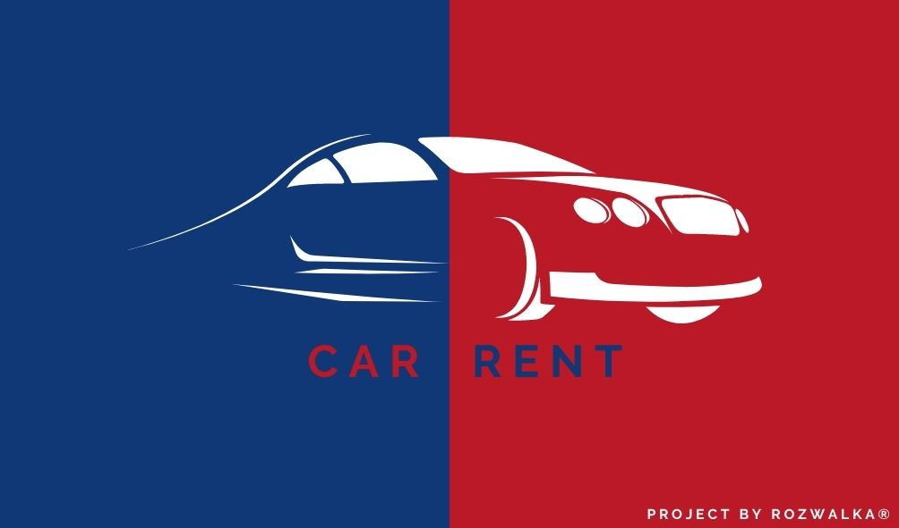

# Car-Rent

---
This is a simple car rent system build with Spring Boot and dependencies/tools/technologies:

* Spring Data JPA
* Liquibase
* Lombok
* Mockito
* MySql
* Junit5
* Integration test

### Methods

---

1. Rent car for user
1. Return car
1. Show user's rent cars
1. Show available cars
1. Search car by a brand or car model
1. Get car by model

## Contact

---
[@Wojciech Rozwałka](https://www.linkedin.com/in/wojciech-rozwalka/) - feel free to contact me!
